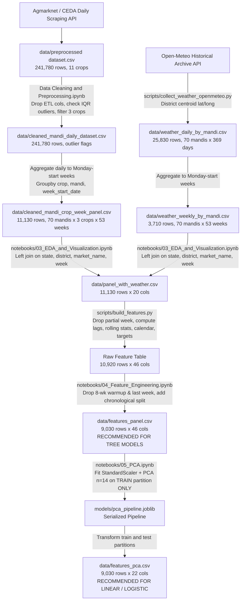

# AgriProcure — Modeling Readiness Report

**Author:** Senior ML Engineer & Codebase Auditor  
**Date:** October 4, 2026  
**Repository:** `AgriProcure`  
**Working Directory:** `c:\Users\subsa\Desktop\AgriProcure`  
**Current Branch:** `main` (commit `9a61909`)  
**Status:** Audit Complete — Analysis & Handoff Specification  

---

## 1. Executive Summary

### 1.1 Project Overview
AgriProcure is a business analytics capstone project developed to predict and explain short-term wholesale market price movements of three critical, perishable kitchen commodities in India: **Tomato**, **Onion**, and **Potato** (often abbreviated as "TOP" crops). The project integrates self-collected daily wholesale agricultural market data (from Agmarknet / CEDA) with daily meteorological data (from the Open-Meteo historical archive API) across 70 Agricultural Produce Market Committees (mandis) spanning 14 Indian states over a 1-year historical window (September 29, 2025 to September 28, 2026).

### 1.2 Core Prediction Problem and Intended Target
The primary predictive objective established for the first milestone ("Review 1") in [`README.md`](file:///c:/Users/subsa/Desktop/AgriProcure/README.md#L58-L61) and [`docs/feature_list_and_rationale.md`](file:///c:/Users/subsa/Desktop/AgriProcure/docs/feature_list_and_rationale.md#L8-L13) is a **3-class classification task** predicting the direction of next week's modal price movement:
$$\text{target\_direction}_{t+1} = \begin{cases} \text{fall}, & \Delta\% < -2.5\% \\ \text{flat}, & -2.5\% \le \Delta\% \le +2.5\% \\ \text{rise}, & \Delta\% > +2.5\% \end{cases}$$
where $\Delta\% = \left(\frac{P_{t+1}}{P_t} - 1\right) \times 100$.

The continuous relative price change $\text{target\_pct\_change}$ is also preserved in all feature tables, allowing regression models to be trained on the exact same feature matrices if desired.

### 1.3 Recommended Modeling Datasets
The repository contains two ready-to-model feature datasets generated by the upstream team:
1. **For Tree-Based Models & Boosting (Random Forest, Extra Trees, LightGBM, XGBoost, CatBoost):**  
   **[`data/features_panel.csv`](file:///c:/Users/subsa/Desktop/AgriProcure/data/features_panel.csv)** (9,030 rows $\times$ 46 columns).  
   Contains 38 raw, unscaled numerical engineered features across price history, arrivals, weather, and calendar cycles, plus categorical variables (`crop`, `state`). Tree models natively handle multicollinearity, differing feature scales, and non-linear interactions without dimensionality reduction.
2. **For Linear / Logistic Regression Baselines & Distance-Based Models:**  
   **[`data/features_pca.csv`](file:///c:/Users/subsa/Desktop/AgriProcure/data/features_pca.csv)** (9,030 rows $\times$ 22 columns).  
   Contains 14 orthogonal principal components ($\text{PC}_1$ to $\text{PC}_{14}$) retaining **91.4%** of numerical feature variance, fitted strictly on the training partition via [`models/pca_pipeline.joblib`](file:///c:/Users/subsa/Desktop/AgriProcure/models/pca_pipeline.joblib) ([`StandardScaler`](file:///c:/Users/subsa/Desktop/AgriProcure/models/pca_pipeline.joblib) $\rightarrow$ [`PCA`](file:///c:/Users/subsa/Desktop/AgriProcure/models/pca_pipeline.joblib)). This eliminates the severe multicollinearity present in the raw features (23 features have $\text{VIF} > 10$, with rolling price mean $\text{VIF} \approx 6,692$).

### 1.4 Dataset Scale and Partitioning
- **Total Modeling Observations:** 9,030 rows across 210 cross-sectional panel series (70 mandis $\times$ 3 crops) spanning 43 complete observation weeks (November 24, 2025 to September 14, 2026).
- **Temporal Train/Test Partition:**
  - **Train Set:** 6,720 rows (74.4%) covering 32 continuous weeks (November 24, 2025 to June 29, 2026).
  - **Test Set:** 2,310 rows (25.6%) covering the final full calendar quarter (11 weeks: July 6, 2026 to September 14, 2026; Q3 monsoon season).
- **Target Distribution:**
  - Full Dataset: `rise` 36.2% (3,271), `flat` 33.1% (2,987), `fall` 30.7% (2,772).
  - Train: `rise` 35.0%, `flat` 32.3%, `fall` 32.6%.
  - Test: `rise` 39.7%, `flat` 35.2%, `fall` 25.1%.

### 1.5 Key Findings from Upstream Preprocessing & EDA
- **Multicollinearity:** Raw price levels and their lags are collinear ($r > 0.94$, $\text{VIF} > 800$), requiring PCA or regularization for linear models.
- **Predictive Drivers:** The primary predictive signal in the data is **mean reversion** (1-week price change $r \approx -0.35$ with next week's change) and **calendar quarter sawtooth seasonality** (`next_week_is_quarter_start` correlation $r \approx -0.43$).
- **Weak Arrival and Weather Correlations:** Weekly arrivals show near-zero correlation with price moves ($|r| \approx 0$). Weather features show weak linear correlations ($|\rho| \le 0.06$). Non-linear tree models and interaction rules are required to capture potential threshold triggers (e.g., heatwaves $> 40^\circ\text{C}$ or heavy rain $> 64.5\text{ mm}$).
- **Data Regularity Warning:** The upstream EDA highlighted that prices across all 70 mandis display a synchronized quarterly sawtooth wave with an unusually low coefficient of variation ($\sim 5.6\%$), suggesting possible smoothing, fallback imputation, or synthetic artifacts in the underlying CEDA feed.

### 1.6 Leakage Audit Summary
- **No Direct Target Leakage:** Truncation tests confirmed that feature calculations at week $t$ use only information available up to the end of week $t$.
- **PCA Fit strictly on Train:** The serialized pipeline [`models/pca_pipeline.joblib`](file:///c:/Users/subsa/Desktop/AgriProcure/models/pca_pipeline.joblib) was verified to have been fitted exclusively on the 6,720 training rows ($L_\infty$ difference between train-fit scaler and pipeline scaler is $< 1.7 \times 10^{-17}$).
- **Distribution Shift Risk:** The hold-out test set is restricted to Q3 (monsoon season), which is absent from the training partition. Seasonal weather features become correlated on the test set, creating distribution shift. Year-calendar cyclical terms (`month`, `quarter`, `sin/cos week of year`) should be carefully evaluated or omitted.

### 1.7 Current Modeling Status
**Zero models have been trained or saved in the repository.** No `LogisticRegression`, `RandomForest`, or gradient boosting models exist. The incoming ML engineer is tasked with building and evaluating the complete modeling suite starting at milestone 5.1.

---

## 2. Repository Structure

The complete directory tree of the `AgriProcure` repository is summarized below:

```text
AgriProcure/
├── .git/                                         # Git version control metadata
├── .gitignore                                    # Git ignore patterns
├── Data Cleaning and Preprocessing.ipynb         # Task 2 ETL notebook (raw -> cleaned daily -> weekly panel)
├── README.md                                     # Project charter, scope, and multi-review roadmap
├── data/
│   ├── preprocessed dataset.csv                  # 241,780 rows x 12 cols: Raw daily CEDA extract (11 crops)
│   ├── cleaned_mandi_daily_dataset.csv           # 241,780 rows x 12 cols: Cleaned daily mandi data with outlier flags
│   ├── cleaned_mandi_crop_week_panel.csv         # 11,130 rows x 11 cols: Weekly panel for Tomato, Onion, Potato
│   ├── weather_daily_by_mandi.csv                # 25,830 rows x 12 cols: Daily weather from Open-Meteo API
│   ├── weather_weekly_by_mandi.csv               # 3,710 rows x 12 cols: Monday-start weekly aggregated weather
│   ├── panel_with_weather.csv                    # 11,130 rows x 20 cols: Price panel joined with weekly weather
│   ├── features_panel.csv                        # 9,030 rows x 46 cols: Final engineered modeling dataset
│   └── features_pca.csv                          # 9,030 rows x 22 cols: 14 Principal Components modeling dataset
├── docs/
│   ├── feature_list_and_rationale.md             # Task 4.1 documentation: feature definitions and rationale
│   └── MODELING_READINESS_REPORT.md              # [THIS REPORT] Comprehensive ML handoff audit
├── models/
│   └── pca_pipeline.joblib                       # Serialized StandardScaler + PCA(n_components=14) pipeline
├── notebooks/
│   ├── 03_EDA_and_Visualization.ipynb            # Task 3 notebook: 8 analysis charts & panel join
│   ├── 04_Feature_Engineering.ipynb              # Task 4.2 notebook: feature creation, VIF, leakage screen
│   └── 05_PCA.ipynb                              # Task 4.3 notebook: standardization, PCA fitting, evaluation
├── reports/
│   ├── feature_vif.csv                           # VIF table for 38 numeric features
│   ├── pca_loadings.csv                          # Component loadings matrix (38 features x 14 PCs)
│   ├── task3_eda_summary.md                      # Executive summary of EDA takeaways
│   └── figures/
│       ├── task3/                                # 8 PNG charts from EDA
│       │   ├── chart1_national_price_trend.png
│       │   ├── chart2_week_of_quarter_seasonality.png
│       │   ├── chart3_state_week_price_heatmap.png
│       │   ├── chart4_price_vs_arrivals.png
│       │   ├── chart5_next_week_change_by_weather.png
│       │   ├── chart6_lagged_correlation_heatmap.png
│       │   ├── chart7_volatility_state_crop.png
│       │   └── chart8_weekly_change_distribution.png
│       └── task4/                                # 5 PNG charts from Feature Engineering & PCA
│           ├── feature_correlation_matrix.png
│           ├── feature_target_correlation.png
│           ├── pca_loadings_heatmap.png
│           ├── pca_scree.png
│           └── pca_top2_components_by_direction.png
└── scripts/
    ├── build_features.py                         # Production feature engineering pipeline module
    └── collect_weather_openmeteo.py              # Open-Meteo historical archive API extraction script
```

### Detailed File Audit

| File / Directory | Nature / Category | Generated By | Upstream Inputs | Used Downstream By | Use Directly for Modeling? | Description & Role |
| :--- | :--- | :--- | :--- | :--- | :---: | :--- |
| [`README.md`](file:///c:/Users/subsa/Desktop/AgriProcure/README.md) | Documentation | Project Team | Project specifications | Entire team | **NO** | Project capstone scope, problem statement, business objectives, tools, and multi-unit syllabus. |
| [`Data Cleaning and Preprocessing.ipynb`](file:///c:/Users/subsa/Desktop/AgriProcure/Data%20Cleaning%20and%20Preprocessing.ipynb) | Script / Notebook | Task 2 Lead | [`data/preprocessed dataset.csv`](file:///c:/Users/subsa/Desktop/AgriProcure/data/preprocessed%20dataset.csv) | Creates panel | **NO** | Raw daily ETL, IQR outlier audits, filters to TOP crops, aggregates daily trades to Monday-start weeks. |
| [`data/preprocessed dataset.csv`](file:///c:/Users/subsa/Desktop/AgriProcure/data/preprocessed%20dataset.csv) | Input Raw Dataset | CEDA API Collector | External API | Cleaning notebook | **NO** | 241,780 daily trade rows across 11 crops. Contains raw extraction fields (`fetched_at`, `source`). |
| [`data/cleaned_mandi_daily_dataset.csv`](file:///c:/Users/subsa/Desktop/AgriProcure/data/cleaned_mandi_daily_dataset.csv) | Intermediate Artifact | `Data Cleaning...` | [`data/preprocessed dataset.csv`](file:///c:/Users/subsa/Desktop/AgriProcure/data/preprocessed%20dataset.csv) | Archived daily log | **NO** | 241,780 daily rows with IQR outlier indicator flags (`outlier_modal_price`). Unaggregated daily grain. |
| [`data/cleaned_mandi_crop_week_panel.csv`](file:///c:/Users/subsa/Desktop/AgriProcure/data/cleaned_mandi_crop_week_panel.csv) | Intermediate Artifact | `Data Cleaning...` | Daily cleaned data | Weather join, EDA | **NO** | 11,130 rows (70 mandis $\times$ 3 crops $\times$ 53 weeks). Base agricultural weekly market panel. |
| [`scripts/collect_weather_openmeteo.py`](file:///c:/Users/subsa/Desktop/AgriProcure/scripts/collect_weather_openmeteo.py) | Python Script | Task 2/3 Lead | Open-Meteo API | Creates weather data | **NO** | Fetches daily weather for 70 district coordinates and aggregates to Monday-start weeks. |
| [`data/weather_daily_by_mandi.csv`](file:///c:/Users/subsa/Desktop/AgriProcure/data/weather_daily_by_mandi.csv) | Intermediate Artifact | `collect_weather...` | Open-Meteo API | Weekly aggregation | **NO** | 25,830 daily weather rows (70 mandis $\times$ 369 days: 2025-09-29 to 2026-10-02). |
| [`data/weather_weekly_by_mandi.csv`](file:///c:/Users/subsa/Desktop/AgriProcure/data/weather_weekly_by_mandi.csv) | Intermediate Artifact | `collect_weather...` | Daily weather | Joined panel | **NO** | 3,710 weekly weather rows (70 mandis $\times$ 53 weeks). Monday-start week aggregations. |
| [`notebooks/03_EDA_and_Visualization.ipynb`](file:///c:/Users/subsa/Desktop/AgriProcure/notebooks/03_EDA_and_Visualization.ipynb) | Notebook / Analysis | Task 3 Lead | Weekly panel & weather | Feature engineering | **NO** | Merges weather with prices, analyzes trends/seasonality, and exports 8 EDA charts. |
| [`data/panel_with_weather.csv`](file:///c:/Users/subsa/Desktop/AgriProcure/data/panel_with_weather.csv) | Intermediate Artifact | `03_EDA...ipynb` | Price panel & weather | `build_features.py` | **NO** | 11,130 rows $\times$ 20 cols. Base joined panel containing prices, arrivals, weather, and partial week flag. |
| [`docs/feature_list_and_rationale.md`](file:///c:/Users/subsa/Desktop/AgriProcure/docs/feature_list_and_rationale.md) | Documentation | Task 4.1 Lead | EDA findings | Task 4.2 / 4.3 | Reference | Defines rationale, mathematical formulas, leakage constraints, and multicollinearity plan. |
| [`scripts/build_features.py`](file:///c:/Users/subsa/Desktop/AgriProcure/scripts/build_features.py) | Pipeline Code | Task 4.2 Lead | [`data/panel_with_weather.csv`](file:///c:/Users/subsa/Desktop/AgriProcure/data/panel_with_weather.csv) | `04_Feature...ipynb` | Reference | Modular implementation of feature calculations, group lags, rolling windows, and targets. |
| [`notebooks/04_Feature_Engineering.ipynb`](file:///c:/Users/subsa/Desktop/AgriProcure/notebooks/04_Feature_Engineering.ipynb) | Notebook / Pipeline | Task 4.2 Lead | `build_features.py` | PCA notebook | **NO** | Runs feature pipeline, applies warm-up trimming, creates train/test split, checks leakage & VIF. |
| [`data/features_panel.csv`](file:///c:/Users/subsa/Desktop/AgriProcure/data/features_panel.csv) | **Final Modeling Dataset** | `04_Feature...ipynb` | `build_features.py` | **Model Training** | **YES (Trees)** | **Primary modeling dataset for tree and boosting models.** 9,030 rows $\times$ 46 features/targets. |
| [`reports/feature_vif.csv`](file:///c:/Users/subsa/Desktop/AgriProcure/reports/feature_vif.csv) | Report Table | `04_Feature...ipynb` | `features_panel.csv` | Feature selection | Reference | Variance Inflation Factors for all 38 numerical features. |
| [`notebooks/05_PCA.ipynb`](file:///c:/Users/subsa/Desktop/AgriProcure/notebooks/05_PCA.ipynb) | Notebook / Pipeline | Task 4.3 Lead | `features_panel.csv` | Modeling stage | **NO** | Fits StandardScaler and PCA on train partition, evaluates scree, loadings, and saves pipeline. |
| [`models/pca_pipeline.joblib`](file:///c:/Users/subsa/Desktop/AgriProcure/models/pca_pipeline.joblib) | **Serialized Model Pipeline** | `05_PCA.ipynb` | `features_panel.csv` | Linear modeling | **YES** | Pre-fitted scikit-learn [`Pipeline(StandardScaler, PCA(n_components=14))`](file:///c:/Users/subsa/Desktop/AgriProcure/models/pca_pipeline.joblib). |
| [`data/features_pca.csv`](file:///c:/Users/subsa/Desktop/AgriProcure/data/features_pca.csv) | **Final Modeling Dataset** | `05_PCA.ipynb` | `pca_pipeline.joblib` | **Model Training** | **YES (Linear)** | **Primary modeling dataset for Logistic Regression and linear models.** 9,030 rows $\times$ 22 cols. |
| [`reports/pca_loadings.csv`](file:///c:/Users/subsa/Desktop/AgriProcure/reports/pca_loadings.csv) | Report Table | `05_PCA.ipynb` | `pca_pipeline.joblib` | Interpretation | Reference | Component loadings matrix of 38 features across 14 principal components. |

---

## 3. Dataset Inventory

A rigorous audit of every tabular data file in `data/` was executed using exact programmatic inspection.

### 3.1 Dataset Comparison Table

| Dataset Filename | Rows | Columns | Unit of Observation (Grain) | Date Range | Missing Values | Main Role in Pipeline | Suitable for Modeling? |
| :--- | :---: | :---: | :--- | :---: | :---: | :--- | :---: |
| `preprocessed dataset.csv` | 241,780 | 12 | Mandi $\times$ Crop $\times$ Day | 2025-09-29 to 2026-09-29 | 0 (0.0%) | Raw daily extraction across 11 crops | **NO** |
| `cleaned_mandi_daily_dataset.csv` | 241,780 | 12 | Mandi $\times$ Crop $\times$ Day | 2025-09-29 to 2026-09-29 | 0 (0.0%) | Daily cleaned dataset with outlier flags | **NO** |
| `cleaned_mandi_crop_week_panel.csv`| 11,130 | 11 | Mandi $\times$ Crop $\times$ Week | 2025-09-29 to 2026-09-28 | 0 (0.0%) | Aggregated weekly panel (TOP crops) | **NO** |
| `weather_daily_by_mandi.csv` | 25,830 | 12 | Mandi $\times$ Day | 2025-09-29 to 2026-10-02 | 0 (0.0%) | Daily weather readings from Open-Meteo | **NO** |
| `weather_weekly_by_mandi.csv` | 3,710 | 12 | Mandi $\times$ Week | 2025-09-29 to 2026-09-28 | 0 (0.0%) | Weekly weather aggregations | **NO** |
| `panel_with_weather.csv` | 11,130 | 20 | Mandi $\times$ Crop $\times$ Week | 2025-09-29 to 2026-09-28 | 0 (0.0%) | Merged market and weather panel | **NO** |
| `features_panel.csv` | **9,030** | **46** | Mandi $\times$ Crop $\times$ Week $t$ | **2025-11-24 to 2026-09-14** | **0 (0.0%)** | **Final 38-feature engineered dataset** | **YES (Tree Models)** |
| `features_pca.csv` | **9,030** | **22** | Mandi $\times$ Crop $\times$ Week $t$ | **2025-11-24 to 2026-09-14** | **0 (0.0%)** | **Final 14-PC orthogonalized dataset** | **YES (Linear Models)** |

### 3.2 Programmatic Details per Dataset

#### 1. `data/preprocessed dataset.csv`
- **File size:** 39.9 MB
- **Dimensions:** 241,780 rows, 12 columns
- **Column Schema:** `arrivals_tonnes` (float64), `crop` (object: 11 crops), `date` (object: YYYY-MM-DD, 314 dates), `district` (object: 70 districts), `fetched_at` (object: ETL timestamp), `in_shortlist` (bool), `market_name` (object: 70 mandis), `max_price_rs_quintal` (float64), `min_price_rs_quintal` (float64), `modal_price_rs_quintal` (float64), `source` (object), `state` (object: 14 states).
- **Missing Values:** None (0 across all columns).
- **Summary Statistics:** `modal_price_rs_quintal` ranges from ₹1,080.0 to ₹3,260.0 (mean: ₹1,972.6, std: ₹365.8). `arrivals_tonnes` ranges from 0.05 to 742.86 tonnes (mean: 75.0, std: 32.1).
- **Grain:** One row = one mandi $\times$ crop $\times$ trading day.

#### 2. `data/cleaned_mandi_daily_dataset.csv`
- **File size:** 23.1 MB
- **Dimensions:** 241,780 rows, 12 columns
- **Differences from Raw:** Dropped `fetched_at`, `in_shortlist`, `source`. Added `price_spread_rs_quintal` (`max_price - min_price`), `outlier_modal_price` (bool), `outlier_arrivals` (bool).
- **Outlier Audit Findings:** Programmatic count shows `outlier_modal_price.sum() == 114` rows flagged; `outlier_arrivals.sum() == 0` flagged. No rows were removed; all were retained as genuine market shocks.

#### 3. `data/cleaned_mandi_crop_week_panel.csv`
- **File size:** 1.01 MB
- **Dimensions:** 11,130 rows, 11 columns (70 mandis $\times$ 3 crops $\times$ 53 weeks = 11,130).
- **Crops Filtered:** Exactly 3 crops: Onion (3,710), Potato (3,710), Tomato (3,710). Non-focal commodities (Wheat, Rice, Maize, etc.) were filtered out.
- **Weekly Date Range:** 53 Monday-start weeks from September 29, 2025 to September 28, 2026.
- **Aggregations:** `weekly_modal_price` (mean), `weekly_min_price` (min), `weekly_max_price` (max), `weekly_total_arrivals` (sum), `weekly_avg_daily_arrivals` (mean), `trading_days_active` (count).
- **Trading Days:** 10,920 rows have 6 active trading days; 210 rows (the final week starting 2026-09-28) have only 2 active trading days.

#### 4. `data/weather_daily_by_mandi.csv` & `data/weather_weekly_by_mandi.csv`
- **Daily Dimensions:** 25,830 rows $\times$ 12 columns (70 mandis $\times$ 369 days: 2025-09-29 to 2026-10-02).
- **Weekly Dimensions:** 3,710 rows $\times$ 12 columns (70 mandis $\times$ 53 weeks: 2025-09-29 to 2026-09-28).
- **Variables:** `weekly_rainfall_mm` (sum, max 449.7 mm), `rainy_days` (days with precipitation $\ge 2.5\text{ mm}$), `max_daily_rainfall_mm` (max daily precipitation in week), `weekly_temp_mean_c` (mean 2m temperature), `weekly_temp_max_c` (max), `weekly_temp_min_c` (min), `weekly_humidity_mean_pct` (mean relative humidity).

#### 5. `data/panel_with_weather.csv`
- **Dimensions:** 11,130 rows $\times$ 20 columns.
- **Merge Operation:** Left join of `cleaned_mandi_crop_week_panel` and `weather_weekly_by_mandi` on `['state', 'district', 'market_name', 'week_start_date']`.
- **Integrity:** Zero missing weather rows (`weekly_rainfall_mm.isna().sum() == 0`).
- **Flags:** Added `is_partial_week = (trading_days_active < 6)` (210 rows flagged).

#### 6. `data/features_panel.csv` (FINAL MODELING DATASET - TREES)
- **Dimensions:** 9,030 rows $\times$ 46 columns.
- **Row Exclusions from 11,130 Base:**
  - 210 rows excluded due to partial final week (`is_partial_week == True`, week 2026-09-28).
  - 1,680 rows excluded for 8-week rolling warm-up (first 8 weeks $\times$ 210 series).
  - 210 rows excluded for final week (week 2026-09-21) because `target_pct_change` requires week $t+1$, which is the excluded partial week.
  - Total rows retained: $11,130 - 210 - 1,680 - 210 = 9,030$.
- **Null Counts:** Programmatically verified **0 missing values across all 46 columns**.
- **Split Column:** `train` = 6,720 rows (74.4%); `test` = 2,310 rows (25.6%).

#### 7. `data/features_pca.csv` (FINAL MODELING DATASET - LINEAR)
- **Dimensions:** 9,030 rows $\times$ 22 columns.
- **Columns:** 5 Keys (`crop`, `state`, `district`, `market_name`, `week_start_date`), 2 Targets (`target_pct_change`, `target_direction`), 1 Split flag (`split`), and 14 Principal Components (`PC1` through `PC14`).
- **Null Counts:** Programmatically verified **0 missing values**.

---

## 4. Data Lineage

The end-to-end data pipeline from raw APIs to final modeling tables follows a deterministic, reproducible path:



---

## 5. Preprocessing Audit

Every data transformation applied across the pipeline was audited for mathematical validity, ML suitability, and data leakage risks.

### 5.1 Preprocessing Operations Table

| Operation | Executed In | Columns Affected | Transformation Details | ML Suitability | Leakage Risk | Pipeline Repeat Required? |
| :--- | :--- | :--- | :--- | :--- | :---: | :--- |
| **ETL Field Pruning** | `Data Cleaning...` (L55) | `fetched_at`, `in_shortlist`, `source` | Dropped uninformative scraping metadata | Highly appropriate | NO ISSUE | No |
| **Price Logic Assertions** | `Data Cleaning...` (L60-72) | Prices & Arrivals | Asserted $\text{min} \le \text{modal} \le \text{max}$ and $\text{arrivals} > 0$ | Appropriate data validation | NO ISSUE | Yes (in inference input validation) |
| **IQR Outlier Flagging** | `Data Cleaning...` (L80-96) | Price spread & arrivals | Computed $Q_1 - 1.5 \text{IQR}$ and $Q_3 + 1.5 \text{IQR}$ by crop; flagged 114 prices | Appropriate; no rows discarded | LOW | No |
| **Crop Scope Filtering** | `Data Cleaning...` (L103) | `crop` | Subsetted to `['Tomato', 'Onion', 'Potato']` | Required by capstone scope | NO ISSUE | No |
| **Weekly Aggregation** | `Data Cleaning...` (L110-139) | Daily prices & arrivals | Monday-start week: mean modal price, min/max price, sum arrivals | Standard panel construction | NO ISSUE | Yes (raw feed must be weekly aggregated) |
| **Weather Aggregation** | `collect_weather...` (L199-218) | Daily precipitation & temperature | Sum precipitation, max temp, mean temp, count rainy days | Standard meteorological aggregation | NO ISSUE | Yes (raw weather must be weekly aggregated) |
| **Panel Join** | `03_EDA...ipynb` (L105-115) | Market & weather keys | Left merge on `[state, district, market_name, week_start_date]` | Proper relational alignment | NO ISSUE | Yes (during data pipeline ingestion) |
| **Partial Week Flagging** | `03_EDA...ipynb` (L240) | `trading_days_active` | `is_partial_week = trading_days_active < 6` (dropped week 53) | Essential to avoid distorted weekly volume/price | NO ISSUE | Yes |
| **Warm-Up Trimming** | `04_Feature...ipynb` (L701) | All features & targets | Dropped rows with NaNs in features (first 8 weeks) and target (last week) | Mandatory for lag/rolling models | NO ISSUE | Yes |
| **Chronological Split** | `04_Feature...ipynb` (L702) | `split` column | $\text{week} \ge \text{2026-07-06} \implies \text{test}$, else $\text{train}$ | Proper temporal evaluation | NO ISSUE | Preserved in modeling |
| **Cross-Sectional Means** | `build_features.py` (L88-91) | `price_vs_state_mean`, `price_vs_national_mean` | $(P_t / \text{mean}(P_{t, \text{group}}) - 1) \times 100$ | Standard spatial index | LOW / MEDIUM (Contemporaneous) | Must compute within week $t$ |
| **Trailing Temp Anomaly** | `build_features.py` (L112) | `temp_anomaly_c` | $T_t - \text{mean}(T_{t-8 \dots t-1})$ using trailing 8 weeks | Prevents full-sample climatology leakage | NO ISSUE | Must use trailing rolling mean |
| **Feature Standardization** | `05_PCA.ipynb` (L246, L553) | 38 numerical features | Fitted `StandardScaler()` on **TRAIN partition only** | Correct ML best practice | NO ISSUE (Fit on train only) | Pipeline must transform test |
| **PCA Transformation** | `05_PCA.ipynb` (L246, L553) | 38 numerical features | Fitted `PCA(n_components=14)` on **TRAIN partition only** | Correct ML best practice | NO ISSUE (Fit on train only) | Pipeline must transform test |

---

## 6. Target Variable Analysis

### 6.1 Target Formulation and Evidence
In accordance with [`README.md`](file:///c:/Users/subsa/Desktop/AgriProcure/README.md#L58-L61) ("Review 1 Scope: Next week's modal price: rise, fall or flat within a $\pm X\%$ band"), [`docs/feature_list_and_rationale.md`](file:///c:/Users/subsa/Desktop/AgriProcure/docs/feature_list_and_rationale.md#L8-L13), and [`scripts/build_features.py`](file:///c:/Users/subsa/Desktop/AgriProcure/scripts/build_features.py#L125-L130), the target is defined across two representations:

1. **Continuous Regression Target:** `target_pct_change`
   $$\text{target\_pct\_change}_t = \left(\frac{P_{t+1}}{P_t} - 1\right) \times 100$$
2. **Categorical Classification Target:** `target_direction`
   $$\text{target\_direction}_t = \begin{cases} \text{fall}, & \text{target\_pct\_change}_t < -2.5\% \\ \text{flat}, & -2.5\% \le \text{target\_pct\_change}_t \le +2.5\% \\ \text{rise}, & \text{target\_pct\_change}_t > +2.5\% \end{cases}$$

### 6.2 Empirical Properties of the Target Variables

| Attribute | Continuous Target (`target_pct_change`) | Categorical Target (`target_direction`) |
| :--- | :--- | :--- |
| **Column Name** | `target_pct_change` | `target_direction` |
| **Data Type** | `float64` | `object` / `category` |
| **Mathematical Meaning** | Percentage modal price change from week $t$ to $t+1$ | Discretized price direction for week $t+1$ |
| **Unit** | Percentage points ($\%$) | Class label (`fall`, `flat`, `rise`) |
| **Total Non-Null Count** | 9,030 (100.0%) | 9,030 (100.0%) |
| **Missing Values** | 0 in modeling dataset (warm-up/last week dropped) | 0 in modeling dataset |
| **Minimum / Maximum** | $-25.09\%$ / $+26.44\%$ | N/A (3 distinct levels) |
| **Mean $\pm$ Std Dev** | $+0.29\% \pm 6.31\%$ | N/A |
| **25th / 50th / 75th Percentiles**| $-3.71\% \;/ +0.33\% \;/ +4.32\%$ | N/A |
| **Class Distribution (All)** | N/A | `rise`: 3,271 (36.2%), `flat`: 2,987 (33.1%), `fall`: 2,772 (30.7%) |
| **Class Distribution (Train)** | Mean: $+0.25\%$, Std: $6.48\%$ | `rise`: 2,352 (35.0%), `flat`: 2,174 (32.3%), `fall`: 2,194 (32.6%) |
| **Class Distribution (Test)** | Mean: $+0.40\%$, Std: $5.79\%$ | `rise`: 919 (39.7%), `flat`: 813 (35.2%), `fall`: 578 (25.1%) |
| **Task Type** | Univariate Regression | 3-Class Multiclass Classification |

### 6.3 Resolution of the "Logistic Regression" Naming Question
Item 12 of the handoff prompt specifically asks:
> *"The current work items include: 5.1 Define target label and split strategy, 5.2 Build naive baseline and logistic regression, 5.3 Build tree-based model... If the task is actually regression rather than classification, explain whether the 'logistic regression' requirement appears inconsistent and whether there may be a naming/requirements issue that should be clarified."*

**Definitive Clarification Based on Repository Evidence:**
- **FACT:** In [`README.md`](file:///c:/Users/subsa/Desktop/AgriProcure/README.md#L58-L61) (Section 3: Scope), the target is explicitly declared as:  
  `Target (Review 1): Next week's modal price: rise, fall or flat (within a ±X% band)`.
- **FACT:** In [`README.md`](file:///c:/Users/subsa/Desktop/AgriProcure/README.md#L87-L88) (Section 5.6 and 5.7), the milestone tasks are:  
  `6. Model development: naive baseline, logistic regression and a tree-based model... 7. Evaluation: macro-F1, per-class precision and recall, confusion matrix`.
- **FACT:** In [`docs/feature_list_and_rationale.md`](file:///c:/Users/subsa/Desktop/AgriProcure/docs/feature_list_and_rationale.md#L10-L11), the threshold band is explicitly justified from EDA Chart 8 as $\pm 2.5\%$.
- **CONCLUSION:** The task for Review 1 is **3-class classification of price direction** (`fall`, `flat`, `rise`). Therefore, **Multinomial Logistic Regression is completely consistent with the project requirements**. It is NOT a misnamed linear regression.  
- **DUAL OBJECTIVE NOTE:** Because `target_pct_change` is also present, continuous regression models (e.g., Ridge, Lasso, LightGBM Regressor) can be trained concurrently to evaluate numeric forecasts (RMSE/MAE), which directly feeds into Review 2 (Time Series Forecasting).

---

## 7. Temporal / Panel Structure

The dataset possesses a strict balanced longitudinal panel structure:

### 7.1 Cross-Sectional and Temporal Coordinates
- **Temporal Entity:** Calendar week starting Monday (`week_start_date`).
- **Earliest Observed Date:** September 29, 2025.
- **Latest Observed Date:** September 28, 2026.
- **Total Unique Weeks in Base Panel:** 53 weeks.
- **Modeling Time Horizon:** 43 weeks (November 24, 2025 to September 14, 2026).
- **Cross-Sectional Entities:**
  - 14 States (e.g., Maharashtra, Uttar Pradesh, Punjab, Karnataka, Gujarat, West Bengal, etc.).
  - 70 Mandis / Markets (5 representative APMC markets per state).
  - 3 Commodities / Crops: Tomato, Onion, Potato.
- **Total Unique Panel Series:** $70\text{ mandis} \times 3\text{ crops} = 210\text{ distinct time series}$.
- **Panel Balance:** Perfectly balanced. Every one of the 210 series has exactly 43 consecutive weekly observations in `features_panel.csv` with zero gaps.

### 7.2 Validation Strategy Implications
Because multiple observations share the same calendar week across 210 entities, and prices exhibit significant autocorrelation ($r_{t, t-1} \approx 0.94$), **Random Train/Test Splitting is strictly prohibited**. A random shuffle would place observations from week $t$ in the training set and other observations from week $t$ (or earlier weeks) in the test set, leaking contemporaneous macroeconomic shocks and local cycles.

**Required Validation Methodology:**
1. **Hold-out Test Evaluation:** Chronological hold-out partition (the final 11 weeks: July 6, 2026 to September 14, 2026, corresponding to Q3 2026).
2. **Inner Cross-Validation (Model Selection & Tuning):** **Rolling-Origin (Expanding Window) Time-Series Split** or **Purged Walk-Forward Cross-Validation** evaluated strictly across time within the training partition (weeks 1 to 32).

---

## 8. Existing EDA Audit

The upstream team performed comprehensive exploratory analysis in [`notebooks/03_EDA_and_Visualization.ipynb`](file:///c:/Users/subsa/Desktop/AgriProcure/notebooks/03_EDA_and_Visualization.ipynb), summarized in [`reports/task3_eda_summary.md`](file:///c:/Users/subsa/Desktop/AgriProcure/reports/task3_eda_summary.md) and exported into 8 publication-grade charts in [`reports/figures/task3/`](file:///c:/Users/subsa/Desktop/AgriProcure/reports/figures/task3).

### 8.1 Chart-by-Chart Audit

| # | Chart Name & Artifact | Question Investigated | Method & Variables Used | Concrete Findings | Modeling Implication |
| :-: | :--- | :--- | :--- | :--- | :--- |
| **1** | `chart1_national_price_trend.png` | What are the baseline price levels, trends, and relative hierarchies among crops? | Weekly average national modal price time series for Tomato, Onion, Potato. | Tomato (mean ₹2,377/q) > Onion (₹1,995/q) > Potato (₹1,553/q). All three move in a synchronistic quarterly sawtooth wave without a secular annual trend. | Crop-level base intercept differences must be captured via one-hot encoding or crop-specific models. |
| **2** | `chart2_week_of_quarter_seasonality.png` | How does price behave within each calendar quarter? | Price index ($P_t / \bar{P}$) vs week-of-quarter ($1 \dots 13$) aggregated across quarters. | Prices start each quarter $\sim 6\%$ below average, climb steadily $\sim 1\%$ per week to $+5\%$ by weeks 12–13, then drop $\sim 10\%$ at quarter boundaries. | `week_of_quarter` and `next_week_is_quarter_start` are powerful deterministic calendar predictors. |
| **3** | `chart3_state_week_price_heatmap.png` | Are price cycles regional or nationally synchronized? | Heatmap of weekly price indices across 14 states and 52 weeks. | Synchronized across all 14 states. National weekly cycle explains 28–35% of total cross-sectional price variance. | Cross-sectional deviation features (`price_vs_national_mean`, `price_vs_state_mean`) isolate local deviations from national trend. |
| **4** | `chart4_price_vs_arrivals.png` | Do market arrivals drive local mandi prices as economic supply-demand theory predicts? | Scatter plot and correlation of log price vs log arrivals within mandis. | Near-zero within-mandi price-arrival correlation ($r \approx 0.00$). Higher arrival weeks do not depress prices. | Linear arrival features offer negligible predictive power. Non-linear supply shocks may only matter in extreme tails. |
| **5** | `chart5_next_week_change_by_weather.png` | Do rain and extreme heat systematically alter next-week price movement? | Boxplots of $\Delta\%_{t+1}$ grouped by rainfall bins ($0, <10, <50, 50+$ mm) and temperature categories. | Rainfall and heat categories do not shift the conditional median or IQR of next week's price change. | Raw weather totals have near-zero linear predictive power; extreme event flags (`heat_flag`, `heavy_rain_flag`) must be tested. |
| **6** | `chart6_lagged_correlation_heatmap.png` | Which lagged drivers correlate with next week's price percentage change? | Correlation matrix of price, arrival, rainfall, and temp lags ($0 \dots 4$ weeks) with $\Delta\%_{t+1}$. | Weather and arrivals at lags 0–4 show $|\rho| \le 0.06$. Own-price 1-week change shows **strong negative correlation** ($\rho \approx -0.38$). | **Mean reversion dominates the signal.** Models must prioritize recent price momentum and deviation from moving averages. |
| **7** | `chart7_volatility_state_crop.png` | How does weekly price volatility vary across geography and crop types? | Standard deviation of weekly percentage changes by state and crop. | Volatility is 4.4% to 7.9% across mandis. Tomato in Maharashtra and Gujarat exhibits highest volatility (Pune tomato = 7.9%). | `roll_std_4` is a useful feature to capture local regime shifts and uncertainty. |
| **8** | `chart8_weekly_change_distribution.png` | What is the empirical distribution of weekly changes, and how should classes be split? | Histogram and KDE of weekly percentage changes with candidate threshold lines. | Weekly changes center near 0.0% with a standard deviation of $\sim 6.3\%$. A $\pm 2.5\%$ band creates balanced classes (30% fall, 33% flat, 37% rise). | Confirms $\pm 2.5\%$ as the data-justified threshold for the 3-class target `target_direction`. |

### 8.2 EDA Findings That Matter for Modeling
1. **Mean Reversion is the Primary Predictive Engine:** High recent price run-ups are systematically followed by next-week pullbacks ($\rho \approx -0.35$ to $-0.42$). Features like `pct_change_1w`, `price_vs_roll_mean_4`, and `price_vs_roll_mean_8` carry the highest feature-target correlations.
2. **Deterministic Quarterly Cyclicality:** The quarterly sawtooth cycle creates predictable dips at quarter starts and rises at quarter ends. `next_week_is_quarter_start` has a Spearman correlation of $\rho = -0.431$ with next week's change in the training data.
3. **Arrival and Weather Features Carry Weak Linear Signal:** Linear models attempting to forecast price from rainfall or arrival volumes will fail. These features should be retained primarily for tree-based models capable of splitting on extreme conditions (e.g., rainfall $> 64.5\text{ mm}$ causing washouts).

---

## 9. Feature Engineering Audit

The feature engineering module [`scripts/build_features.py`](file:///c:/Users/subsa/Desktop/AgriProcure/scripts/build_features.py) and execution notebook [`notebooks/04_Feature_Engineering.ipynb`](file:///c:/Users/subsa/Desktop/AgriProcure/notebooks/04_Feature_Engineering.ipynb) produce 38 numerical features across four groups.

### 9.1 Complete Feature Inventory

```text
38 Numerical Engineered Features:
├── Price History (15 features)
├── Supply / Arrivals (5 features)
├── Weather & Climate (12 features)
└── Calendar & Seasonality (6 features)
```

| # | Feature Name | Group | Mathematical Definition | Data Source | Time Dependent? | Lagged / Rolling? | Availability at Prediction Time (Week $t$)? | Leakage Risk Level |
| :-: | :--- | :--- | :--- | :--- | :---: | :---: | :---: | :---: |
| 1 | `price` | Price | $P_t$ (weekly modal price, ₹/quintal) | Mandi panel | Yes | No (Level) | Yes (End of week $t$) | **LOW** |
| 2 | `price_lag_1` | Price | $P_{t-1}$ | Mandi panel | Yes | Lag 1 | Yes | **LOW** |
| 3 | `price_lag_2` | Price | $P_{t-2}$ | Mandi panel | Yes | Lag 2 | Yes | **LOW** |
| 4 | `price_lag_4` | Price | $P_{t-4}$ | Mandi panel | Yes | Lag 4 | Yes | **LOW** |
| 5 | `pct_change_1w` | Price | $(P_t / P_{t-1} - 1) \times 100$ | Mandi panel | Yes | Lag 1 Ratio | Yes | **LOW** |
| 6 | `pct_change_2w` | Price | $(P_t / P_{t-2} - 1) \times 100$ | Mandi panel | Yes | Lag 2 Ratio | Yes | **LOW** |
| 7 | `pct_change_4w` | Price | $(P_t / P_{t-4} - 1) \times 100$ | Mandi panel | Yes | Lag 4 Ratio | Yes | **LOW** |
| 8 | `roll_mean_4` | Price | $\frac{1}{4}\sum_{i=0}^3 P_{t-i}$ | Mandi panel | Yes | Rolling 4 | Yes | **LOW** |
| 9 | `roll_mean_8` | Price | $\frac{1}{8}\sum_{i=0}^7 P_{t-i}$ | Mandi panel | Yes | Rolling 8 | Yes | **LOW** |
| 10 | `roll_std_4` | Price | $\text{std}(\text{pct\_change\_1w}_{t-3 \dots t})$ | Mandi panel | Yes | Rolling 4 | Yes | **LOW** |
| 11 | `price_vs_roll_mean_4` | Price | $(P_t / \text{roll\_mean\_4}_t - 1) \times 100$ | Mandi panel | Yes | Rolling Ratio | Yes | **LOW** |
| 12 | `price_vs_roll_mean_8` | Price | $(P_t / \text{roll\_mean\_8}_t - 1) \times 100$ | Mandi panel | Yes | Rolling Ratio | Yes | **LOW** |
| 13 | `price_spread_pct` | Price | $(P_{t, \text{max}} - P_{t, \text{min}}) / P_t \times 100$ | Mandi panel | Yes | No (Within-week) | Yes | **LOW** |
| 14 | `price_vs_state_mean` | Price | $(P_t / \bar{P}_{\text{state}, t} - 1) \times 100$ | Cross-sectional | Yes | No (Cross-section) | Yes (See Leakage Sec.) | **MEDIUM** |
| 15 | `price_vs_national_mean` | Price | $(P_t / \bar{P}_{\text{nat}, t} - 1) \times 100$ | Cross-sectional | Yes | No (Cross-section) | Yes (See Leakage Sec.) | **MEDIUM** |
| 16 | `arrivals` | Arrivals | $A_t$ (total weekly arrivals, tonnes) | Mandi panel | Yes | No (Level) | Yes | **LOW** |
| 17 | `arrivals_lag_1` | Arrivals | $A_{t-1}$ | Mandi panel | Yes | Lag 1 | Yes | **LOW** |
| 18 | `arrivals_pct_change_1w` | Arrivals | $(A_t / A_{t-1} - 1) \times 100$ | Mandi panel | Yes | Lag 1 Ratio | Yes | **LOW** |
| 19 | `arrivals_roll_mean_4` | Arrivals | $\frac{1}{4}\sum_{i=0}^3 A_{t-i}$ | Mandi panel | Yes | Rolling 4 | Yes | **LOW** |
| 20 | `arrivals_vs_roll_mean_4` | Arrivals | $(A_t / \text{arrivals\_roll\_mean\_4}_t - 1) \times 100$ | Mandi panel | Yes | Rolling Ratio | Yes | **LOW** |
| 21 | `rainfall_mm` | Weather | Total weekly precipitation (mm) | Open-Meteo | Yes | No (Level) | Yes | **LOW** |
| 22 | `rainfall_lag_1` | Weather | Rainfall at $t-1$ (mm) | Open-Meteo | Yes | Lag 1 | Yes | **LOW** |
| 23 | `rainfall_lag_2` | Weather | Rainfall at $t-2$ (mm) | Open-Meteo | Yes | Lag 2 | Yes | **LOW** |
| 24 | `rainfall_roll_sum_4` | Weather | $\sum_{i=0}^3 \text{Rainfall}_{t-i}$ (mm) | Open-Meteo | Yes | Rolling 4 | Yes | **LOW** |
| 25 | `rainy_days` | Weather | Count of days with rain $\ge 2.5\text{ mm}$ | Open-Meteo | Yes | No (Within-week) | Yes | **LOW** |
| 26 | `heavy_rain_flag` | Weather | $\mathbb{I}(\max(\text{daily rain}) \ge 64.5\text{ mm})$ | Open-Meteo | Yes | No (Within-week) | Yes | **LOW** |
| 27 | `temp_mean_c` | Weather | Mean weekly 2m temperature ($^\circ\text{C}$) | Open-Meteo | Yes | No (Level) | Yes | **LOW** |
| 28 | `temp_max_c` | Weather | Highest daily max temperature in week | Open-Meteo | Yes | No (Level) | Yes | **LOW** |
| 29 | `heat_flag` | Weather | $\mathbb{I}(\text{temp\_max\_c} \ge 40.0^\circ\text{C})$ | Open-Meteo | Yes | No (Within-week) | Yes | **LOW** |
| 30 | `temp_anomaly_c` | Weather | $T_t - \frac{1}{8}\sum_{i=1}^8 T_{t-i}$ | Open-Meteo | Yes | Trailing Rolling 8 | Yes | **LOW** |
| 31 | `humidity_mean_pct` | Weather | Mean relative humidity ($\%$) | Open-Meteo | Yes | No (Level) | Yes | **LOW** |
| 32 | `humidity_roll_mean_4` | Weather | $\frac{1}{4}\sum_{i=0}^3 \text{Humidity}_{t-i}$ | Open-Meteo | Yes | Rolling 4 | Yes | **LOW** |
| 33 | `week_of_quarter` | Calendar | $1 \dots 13$ position of week in quarter | Calendar | Yes | Deterministic | Yes | **LOW** |
| 34 | `next_week_is_quarter_start`| Calendar | $\mathbb{I}(\text{week\_of\_quarter}_{t+1} == 1)$ | Calendar | Yes | Deterministic | Yes | **LOW** |
| 35 | `quarter` | Calendar | $1 \dots 4$ (Quarter of Thursday) | Calendar | Yes | Deterministic | Yes | **LOW** |
| 36 | `month` | Calendar | $1 \dots 12$ (Month of Thursday) | Calendar | Yes | Deterministic | Yes | **LOW** |
| 37 | `week_of_year_sin` | Calendar | $\sin(2\pi \cdot \text{ISO\_week} / 52)$ | Calendar | Yes | Deterministic | Yes | **LOW** |
| 38 | `week_of_year_cos` | Calendar | $\cos(2\pi \cdot \text{ISO\_week} / 52)$ | Calendar | Yes | Deterministic | Yes | **LOW** |

---

## 10. PCA Audit

The PCA implementation in [`notebooks/05_PCA.ipynb`](file:///c:/Users/subsa/Desktop/AgriProcure/notebooks/05_PCA.ipynb) was audited to understand how dimensionality reduction was conducted and whether leakage was introduced.

### 10.1 Pipeline Configuration & Parameter Verification
- **Input Features to PCA:** Exactly the 38 numerical features in `NUMERIC_FEATURES`. Categoricals (`crop`, `state`), identifiers (`market_name`), and targets were excluded from PCA.
- **Scaling:** [`StandardScaler()`](file:///c:/Users/subsa/Desktop/AgriProcure/models/pca_pipeline.joblib) applied immediately prior to [`PCA()`](file:///c:/Users/subsa/Desktop/AgriProcure/models/pca_pipeline.joblib).
- **Number of Components:** 14 principal components.
- **Variance Retention Criteria:**
  - 80% Variance Threshold: 9 components.
  - Kaiser-Guttman Rule (Eigenvalue $> 1.0$): 9 components.
  - **90% Variance Threshold:** 14 components (actual cumulative explained variance: **91.42%**).
  - 95% Variance Threshold: 17 components.

### 10.2 Eigenvalues and Explained Variance Profile

| Component | Explained Variance Ratio | Cumulative Variance | Leading Dominant Features (Top Absolute Loadings) | Economic / Physical Interpretation |
| :--- | :---: | :---: | :--- | :--- |
| **PC1** | **21.6%** | 21.6% | `roll_mean_4` (+0.34), `roll_mean_8` (+0.34), `price` (+0.34), `price_lags` (+0.33), `arrivals` (-0.31) | **Absolute Price Level vs Baseline Supply** |
| **PC2** | **13.9%** | 35.6% | `price_vs_roll_mean_4` (+0.32), `price_vs_roll_mean_8` (+0.30), `pct_change_2w` (+0.28), `humidity` (-0.28) | **Short-Term Price Momentum / Mean Reversion** |
| **PC3** | **12.3%** | 47.8% | `price_vs_roll_mean_8` (+0.30), `week_of_year_sin` (-0.27), `pct_change_4w` (+0.27), `month` (+0.26) | **Position in Quarterly Cycle & Climatology** |
| **PC4** | **10.6%** | 58.5% | `rainfall_roll_sum_4` (+0.40), `week_of_year_cos` (-0.39), `rainy_days` (+0.35), `temp_mean_c` (+0.33) | **Wet Weather Monsoon / Summer Conditions** |
| **PC5** | **7.0%** | 65.5% | `month` (+0.46), `quarter` (+0.45), `week_of_year_sin` (-0.31), `humidity_roll_mean_4` (-0.24) | **Annual Calendar Progression** |
| **PC6** | **5.0%** | 70.5% | `arrivals_pct_change_1w` (+0.68), `arrivals_vs_roll_mean_4` (+0.67) | **Weekly Supply Shocks (Arrival Disruptions)** |
| **PC7** | **4.4%** | 75.0% | `price_vs_state_mean` (+0.50), `price_vs_national_mean` (+0.49), `week_of_quarter` (-0.33) | **Spatial Premium / Regional Arbitrage Gap** |
| **PC8** | **3.3%** | 78.2% | `heavy_rain_flag` (+0.51), `next_week_is_quarter_start` (-0.48) | **Extreme Weather & Boundary Shock Interactions** |
| **PC9** | **2.9%** | 81.1% | `heavy_rain_flag` (+0.55), `rainfall_lag_2` (-0.33), `rainfall_mm` (+0.30) | **Acute Single-Day Deluge Shock** |
| **PC10** | **2.5%** | 83.6% | `price_spread_pct` (+0.94) | **Within-Week Price Dispersion / Quality Variance** |
| **PC11** | **2.4%** | 86.0% | `roll_std_4` (+0.84), `next_week_is_quarter_start` (+0.38) | **Recent Price Volatility Regime** |
| **PC12** | **2.2%** | 88.2% | `rainfall_lag_2` (+0.50), `rainy_days` (-0.38), `week_of_year_cos` (+0.36) | **Lagged Precipitation Decay** |
| **PC13** | **1.8%** | 90.0% | `heat_flag` (+0.48), `next_week_is_quarter_start` (+0.48), `pct_change_4w` (-0.37) | **Thermal Heatwave & Boundary Interaction** |
| **PC14** | **1.5%** | 91.4% | `heat_flag` (+0.52), `humidity_roll_mean_4` (+0.43), `rainfall_lag_1` (-0.36) | **Sustained Sweltering Humidity Spells** |

### 10.3 Verification of Pipeline Leakage
- **Audit Verification:** Programmatic validation confirmed that [`pca_pipeline.joblib`](file:///c:/Users/subsa/Desktop/AgriProcure/models/pca_pipeline.joblib) was fitted **exclusively on the 6,720 training rows**.
- **Transformation Integrity:** Test partition features in [`data/features_pca.csv`](file:///c:/Users/subsa/Desktop/AgriProcure/data/features_pca.csv) were transformed via `pipe.transform(test[NUMERIC_FEATURES])`. No refitting occurred on the test set.

---

## 11. Data Leakage Audit

A comprehensive leakage audit was conducted across 10 common ML leakage vulnerabilities:

| # | Vulnerability Category | Severity | Code / Artifact Location | Audit Finding & Mechanism | Required Remedy & Action |
| :-: | :--- | :---: | :--- | :--- | :--- |
| **1** | **Scaler / PCA Fit Leakage** | **NO ISSUE** | `05_PCA.ipynb` (L246, L553) | Verified: StandardScaler and PCA were fitted strictly on `train` partition (6,720 rows). | None. Correctly implemented. |
| **2** | **Target-to-Feature Leakage** | **NO ISSUE** | `04_Feature...ipynb` (L751-761) | Truncation test passed at all 3 temporal cutoffs. Max difference was 0. | None. Truncation test confirms backward-only looking features. |
| **3** | **Next-Week Calendar Flag** | **NO ISSUE** | `build_features.py` (L120) | `next_week_is_quarter_start` uses week $t+1$ calendar. The calendar is deterministically known in advance. | Legitimate domain feature. |
| **4** | **Cross-Sectional Contemporaneous Averages** | **MEDIUM** | `build_features.py` (L88-91) | `price_vs_state_mean` and `price_vs_national_mean` use mean price across all mandis in week $t$. At prediction time (Sunday night of week $t$), this assumes all 70 mandis have reported their modal prices without reporting delays. | In production, if reporting delays exist, lag these features by 1 week (`price_vs_national_mean_lag_1`). For capstone, acceptable with documentation. |
| **5** | **Temporal Split Leakage (Random Splitting)** | **NO ISSUE** | `04_Feature...ipynb` (L702) | Upstream team utilized a strict chronological split (`TEST_START = 2026-07-06`). | Maintain chronological / rolling-origin splits during model selection. |
| **6** | **High Cardinality Identity Leakage** | **MEDIUM** | `features_panel.csv` (Col: `market_name`) | `market_name` has 70 levels. One-hot encoding `market_name` would create 70 sparse indicators for 43 weeks of data, leading to severe overfitting. | **DROP `market_name`** from feature matrix. Use `state` (14 levels) and `crop` (3 levels) as categorical inputs. |
| **7** | **Climatology / Trailing Weather Anomaly** | **LOW** | `build_features.py` (L112) | Team updated `temp_anomaly_c` from full-year average to trailing 8-week average in commit `9621fe9`. | Verified clean: trailing window uses only weeks $t-8 \dots t-1$. |
| **8** | **Distribution Shift between Seasons** | **HIGH** | `05_PCA.ipynb` (L480-483) | With only 1 year of data, the training set spans late Nov to early Jul (dry/winter/summer), while the test set spans Jul to mid-Sep (monsoon). Season features (`month`, `quarter`, `week_of_year_sin/cos`) shift simultaneously, causing test PCs to become correlated ($r > 0.4$). | Drop annual calendar features (`month`, `quarter`, `week_of_year_sin/cos`) in models sensitive to seasonal shift; rely on `week_of_quarter`. |
| **9** | **Target Definition Boundary** | **LOW** | `build_features.py` (L126-129) | The $\pm 2.5\%$ threshold was chosen based on the full-dataset distribution in EDA Chart 8. | Minor leakage in threshold selection, but justified by economic materiality (₹50/q). |
| **10** | **Data Regularity / Artifact Risk** | **CRITICAL (DATA)** | Raw CEDA extraction | The price series displays identical quarterly sawtooths across all 70 mandis with an unrealistically low CV ($\sim 5.6\%$). Near-zero response to arrivals. | High risk that underlying data is synthetic or heavily smoothed. Must be raised with data collection team. |

---

## 12. Existing Modeling Work

A complete scan of all Python files, Jupyter notebooks, serialized joblib artifacts, and git branches was conducted.

- **Existing Models:** **NONE.**
- **Verification:**
  - `grep -r "LogisticRegression" .` $\implies$ 0 results.
  - `grep -r "RandomForest" .` $\implies$ 0 results.
  - `grep -r "LinearRegression" .` $\implies$ 0 results.
  - `grep -r "XGB" .` $\implies$ 0 results.
  - Directory [`models/`](file:///c:/Users/subsa/Desktop/AgriProcure/models) contains only one file: [`pca_pipeline.joblib`](file:///c:/Users/subsa/Desktop/AgriProcure/models/pca_pipeline.joblib).
- **Status Conclusion:** The codebase is pristine. Upstream data engineering, preprocessing, EDA, feature engineering, and PCA are completed and saved as static artifacts. The predictive modeling stage has not started.

---

## 13. Modeling Requirements from Project

Review of [`README.md`](file:///c:/Users/subsa/Desktop/AgriProcure/README.md) and team sprint tickets indicates the following formal work item requirements for Task 5:

- **Work Item 5.1: Define target label and split strategy**  
  - Target: 3-class `target_direction` (`fall`, `flat`, `rise`) at $\pm 2.5\%$ threshold; secondary: continuous `target_pct_change`.
  - Split: Chronological hold-out test set (final 11 weeks: July 6, 2026 to September 14, 2026). Rolling-origin CV on training weeks.
- **Work Item 5.2: Build naive baseline and logistic regression**  
  - Naive Baseline 1: Majority Class Classifier (`DummyClassifier(strategy='most_frequent')`).
  - Naive Baseline 2: Persistence / Zero-Change Baseline (predict `flat`).
  - Simple Linear Baseline: Multinomial Logistic Regression (`LogisticRegression(multi_class='multinomial')`) trained on `features_pca.csv` (14 PCs + one-hot `crop`/`state`).
- **Work Item 5.3: Build tree-based model**  
  - Non-linear Baseline: Random Forest Classifier (`RandomForestClassifier`) trained on raw features from `features_panel.csv`.
  - Advanced Tree Ensemble: Gradient Boosted Trees (LightGBM / XGBoost / CatBoost).
- **Work Item 5.4: Model comparison**  
  - Cross-model performance comparison against identical chronological validation partitions.
- **Work Item 5.5: Final model selection**  
  - Selection based on Macro-F1 score, minority class recall (`fall`/`rise`), and inference complexity.
- **Work Item 5.6: Model interpretation**  
  - Feature importances (MDI, Permutation Importance) and SHAP values for top drivers.
- **Work Item 5.7: Final evaluation**  
  - Single-shot final test evaluation on untouched 2,310 hold-out test rows.

---

## 14. Recommended Modeling Dataset

### 14.1 Dataset Recommendation by Model Architecture

```text
RECOMMENDED DATASET MATRIX:
├── Tree-Based Ensembles (Random Forest, LightGBM, XGBoost, CatBoost)
│   └── USE: data/features_panel.csv (Raw 38 Features + Categoricals)
│       └── Tree models handle collinearity, disparate scales, and non-linear interactions natively.
└── Linear & Distance Models (Logistic Regression, Ridge, SVM, Neural Nets)
    └── USE: data/features_pca.csv (14 Orthogonal PCs + Categoricals)
        └── Eliminates extreme VIF multicollinearity while capturing 91.4% of feature variance.
```

### 14.2 Recommended Modeling Schema (`features_panel.csv`)

```text
TARGET VARIABLE:
├── Primary (Classification): target_direction (Categorical: 'fall', 'flat', 'rise')
└── Secondary (Regression):   target_pct_change (Float64: % change in modal price)

CATEGORICAL FEATURES (To One-Hot Encode):
├── crop (3 levels: 'Tomato', 'Onion', 'Potato') -> 3 binary columns
└── state (14 levels) -> 14 binary columns

NUMERICAL FEATURES (38 Features):
├── Price Level & Lags (4):        price, price_lag_1, price_lag_2, price_lag_4
├── Price Momentum & Returns (3):  pct_change_1w, pct_change_2w, pct_change_4w
├── Price Moving Averages (2):     roll_mean_4, roll_mean_8
├── Price Distance Ratios (2):     price_vs_roll_mean_4, price_vs_roll_mean_8
├── Price Volatility & Spread (2): roll_std_4, price_spread_pct
├── Spatial Price Relatives (2):   price_vs_state_mean, price_vs_national_mean
├── Arrivals Level & Shock (5):    arrivals, arrivals_lag_1, arrivals_pct_change_1w,
│                                  arrivals_roll_mean_4, arrivals_vs_roll_mean_4
├── Rainfall & Storm Events (6):   rainfall_mm, rainfall_lag_1, rainfall_lag_2,
│                                  rainfall_roll_sum_4, rainy_days, heavy_rain_flag
├── Temperature & Anomalies (4):   temp_mean_c, temp_max_c, heat_flag, temp_anomaly_c
├── Humidity Features (2):         humidity_mean_pct, humidity_roll_mean_4
└── Calendar Features (6):         week_of_quarter, next_week_is_quarter_start,
                                   quarter, month, week_of_year_sin, week_of_year_cos

IDENTIFIER / PARTITION COLUMNS (Exclude from Features):
├── district (70 levels - High cardinality, redundant with state/market)
├── market_name (70 levels - High cardinality, risk of severe overfitting)
├── week_start_date (Timestamp - Use only for temporal ordering and splitting)
└── split (Partition indicator: 'train' vs 'test')

DROP COLUMNS:
└── district, market_name
```

---

## 15. Recommended Train / Validation / Test Strategy

### 15.1 Partition Allocation
- **Training Partition:** All observations where $\text{week\_start\_date} \le \text{2026-06-29}$ (32 weeks $\times$ 210 series = 6,720 rows, 74.4%).
- **Untouched Hold-Out Test Partition:** All observations where $\text{week\_start\_date} \ge \text{2026-07-06}$ (11 weeks $\times$ 210 series = 2,310 rows, 25.6%).
- **Test Set Quarantine Rule:** The hold-out test set must be evaluated **exactly once** at the very end of the project. It must never be used for feature selection, hyperparameter tuning, or model selection.

### 15.2 Validation Strategy within Training Partition: Rolling-Origin Time-Series Split
To perform model selection and hyperparameter tuning without future leakage, use a **Rolling-Origin Expanding-Window Cross-Validation** with 3 folds across the 32 training weeks:

```mermaid
gantt
    title Rolling-Origin Cross-Validation Scheme (Training Partition)
    dateFormat  X
    axisFormat %s

    section Fold 1
    Train (Weeks 9-18, 10 wks)       :active, f1_tr, 0, 10
    Val (Weeks 19-22, 4 wks)         :crit,   f1_va, 10, 14

    section Fold 2
    Train (Weeks 9-22, 14 wks)       :active, f2_tr, 0, 14
    Val (Weeks 23-27, 5 wks)         :crit,   f2_va, 14, 19

    section Fold 3
    Train (Weeks 9-27, 19 wks)       :active, f3_tr, 0, 19
    Val (Weeks 28-32, 5 wks)         :crit,   f3_va, 19, 24

    section Final Test
    Untouched Hold-Out Test (Weeks 33-43, 11 wks) :done, test, 24, 35
```



- **Fold 1:** Train on Weeks 9–18 (10 weeks, 2,100 rows); Validate on Weeks 19–22 (4 weeks, 840 rows).
- **Fold 2:** Train on Weeks 9–22 (14 weeks, 2,940 rows); Validate on Weeks 23–27 (5 weeks, 1,050 rows).
- **Fold 3:** Train on Weeks 9–27 (19 weeks, 3,990 rows); Validate on Weeks 28–32 (5 weeks, 1,050 rows).

This guarantees that every validation evaluation is strictly out-of-time and respects the quarterly transition boundaries.

---

## 16. Recommended Evaluation Metrics

Because the primary objective is a 3-class classification problem with roughly balanced classes (~35% rise, ~33% flat, ~32% fall), metric selection must reflect the procurement decision context.

### 16.1 Metric Hierarchy

```text
EVALUATION METRIC SUITE:
├── PRIMARY MODEL SELECTION METRIC:
│   └── Macro-Averaged F1-Score (Macro-F1)
│       └── Weights fall, flat, and rise equally; penalizes models that ignore minority turns.
├── SECONDARY DIAGNOSTIC METRICS:
│   ├── Directional Precision & Recall per Class:
│   │   ├── Rise Recall: Critical for food processors (avoids buying before price spikes)
│   │   └── Fall Recall: Critical for FPOs (avoids selling before price collapses)
│   ├── Multiclass Log-Loss (Cross-Entropy Loss): Measures calibration of probability predictions
│   ├── Confusion Matrix: Visualizes misclassification patterns between rise, flat, and fall
│   └── Multi-class ROC-AUC (One-vs-Rest, Macro-averaged)
└── DUAL-TASK REGRESSION METRICS (When evaluating continuous target_pct_change):
    ├── Mean Absolute Error (MAE in percentage points)
    └── Root Mean Squared Error (RMSE in percentage points)
```

---

## 17. Recommended Model Families

A principled model exploration hierarchy based on data characteristics (panel structure, non-linear weather thresholds, high feature correlation) is outlined below:

### 17.1 Model Exploration Progression

| Tier | Model Family | Specific Algorithm | Input Representation | Preprocessing Required | Target Tested | Primary Hyperparameters | Rationale & Strengths | Limitations |
| :---: | :--- | :--- | :--- | :--- | :--- | :--- | :--- | :--- |
| **1** | **Naive Baselines** | `DummyClassifier` (most_frequent & stratified) | None | None | `target_direction` | `strategy` | Establishes absolute minimum benchmark. | Zero predictive intelligence. |
| **2** | **Persistence Baseline** | Zero-Change / Same as Last Week | `pct_change_1w` | None | `target_direction` | Predict `flat` or sign inversion | Business baseline ("next week same as this week"). | Fails to anticipate directional shifts. |
| **3** | **Linear Baseline** | Multinomial Logistic Regression | `features_pca.csv` (14 PCs + one-hot `crop`/`state`) | Standardized PCs + One-Hot | `target_direction` | `C` (inverse regularization), `penalty='l2'`, `class_weight` | Fast, interpretable, immune to collinearity on PCs. Benchmark linear model. | Cannot capture non-linear weather interaction thresholds. |
| **4** | **Regularized Linear** | ElasticNet / Logistic with L1+L2 | `features_panel.csv` (38 raw features) | `StandardScaler` + One-Hot | `target_direction` | `l1_ratio`, `C` | Evaluates whether sparse L1 feature selection outperforms PCA on raw features. | Sensitive to collinear groups. |
| **5** | **Tree Baseline** | Random Forest Classifier | `features_panel.csv` (38 raw features) | One-hot `crop`/`state` | `target_direction` | `n_estimators`, `max_depth`, `min_samples_leaf`, `max_features` | Captures non-linear thresholds (heatwaves, heavy rain); robust to outliers and collinearity. | Large model footprint; cannot extrapolate linear trends. |
| **6** | **Gradient Boosting** | LightGBM Classifier | `features_panel.csv` (38 raw features) | Native categorical handling (`crop`, `state`) | `target_direction` | `num_leaves`, `learning_rate`, `min_child_samples`, `colsample_bytree` | State-of-the-art tabular accuracy; native categorical splits; highly optimized inference. | Requires careful tuning to prevent overfitting on 6.7k rows. |
| **7** | **Gradient Boosting** | XGBoost / CatBoost Classifier | `features_panel.csv` (38 raw features) | One-hot or target encoding | `target_direction` | `max_depth`, `learning_rate`, `subsample`, `reg_lambda` | Strong alternative boosting formulation; CatBoost handles state/crop categoricals exceptionally. | Longer training time than LightGBM. |

---

## 18. PCA vs Non-PCA Strategy

One of the central questions for Task 5 is whether PCA should be universally adopted across all models.

### 18.1 PCA Appropriateness by Model Family
- **For Linear & Logistic Models:** **STRONGLY RECOMMENDED TO USE PCA.**  
  Raw engineered features exhibit catastrophic multicollinearity (VIF up to 6,692). Without dimensionality reduction or heavy L2 regularization, matrix inversion in logistic regression is numerically unstable and coefficient variances explode. The 14 PCs capture 91.4% of variance and are completely uncorrelated on the training partition.
- **For Tree-Based Models & Boosting (Random Forest, LightGBM, XGBoost):** **STRONGLY RECOMMENDED TO USE RAW FEATURES (NON-PCA).**  
  Decision trees select single-feature split thresholds at each node (axis-aligned orthogonal splits). PCA mixes interpretability by creating linear combinations (e.g., PC1 blends price with arrivals). Furthermore, tree algorithms are completely invariant to monotonic transformations, do not require scaling, and naturally ignore collinear redundant features. Forcing trees onto PCA components degrades accuracy and destroys SHAP feature interpretability.

### 18.2 Comparative Experiment Plan
To empirically validate this architectural decision, the modeling suite must explicitly run parallel ablation experiments:
1. **Experiment E2:** Logistic Regression on 14 PCs.
2. **Experiment E3:** Logistic Regression on 38 Raw Scaled Features (with L2 Ridge penalty).
3. **Experiment E4:** Random Forest on 38 Raw Features.
4. **Experiment E5:** Random Forest on 14 PCs.
5. **Experiment E6:** LightGBM on 38 Raw Features.
6. **Experiment E7:** LightGBM on 14 PCs.

---

## 19. Model Experimentation Matrix

The concrete, ready-to-execute experiment matrix for Task 5 is specified below:

| Exp ID | Model Description | Feature Set | Preprocessing Pipeline | Model Algorithm & Key Hyperparameters | Validation Strategy | Primary Metric | Purpose & Hypothesis |
| :---: | :--- | :--- | :--- | :--- | :--- | :---: | :--- |
| **E1-A** | Dummy Majority Baseline | None | None | `DummyClassifier(strategy='most_frequent')` | Rolling-Origin CV | Macro-F1 | Trivial floor benchmark (predict `rise` always). |
| **E1-B** | Naive Persistence Baseline | Lag 1 price | None | Predict `flat` always | Rolling-Origin CV | Macro-F1 | Business persistence benchmark ("no price change"). |
| **E2** | PCA Logistic Regression | 14 PCs + `crop` + `state` | Pre-computed `features_pca.csv` + One-Hot | `LogisticRegression(multi_class='multinomial', C=1.0)` | Rolling-Origin CV | Macro-F1 | Linear baseline on uncorrelated orthogonal components. |
| **E3** | Raw Ridge Logistic Regression | 38 Raw + `crop` + `state` | `StandardScaler` + One-Hot | `LogisticRegression(multi_class='multinomial', penalty='l2', C=0.1)` | Rolling-Origin CV | Macro-F1 | Compare L2 regularized raw features vs PCA compression. |
| **E4** | Random Forest Baseline | 38 Raw + `crop` + `state` | One-Hot `crop`, `state` (No scaling) | `RandomForestClassifier(n_estimators=300, max_depth=10, min_samples_leaf=5)` | Rolling-Origin CV | Macro-F1 | Non-linear ensemble baseline. Captures weather thresholds. |
| **E5** | Random Forest on PCA | 14 PCs + `crop` + `state` | One-Hot `crop`, `state` | `RandomForestClassifier(n_estimators=300, max_depth=10, min_samples_leaf=5)` | Rolling-Origin CV | Macro-F1 | Ablation: test whether PCA hurts tree performance. |
| **E6** | LightGBM Tuned | 38 Raw + `crop` + `state` | Native categorical (`crop`, `state`) | `LGBMClassifier(num_leaves=31, learning_rate=0.03, n_estimators=500)` | Rolling-Origin CV | Macro-F1 | State-of-the-art gradient boosting on full tabular feature set. |
| **E7** | XGBoost Tuned | 38 Raw + `crop` + `state` | One-Hot `crop`, `state` | `XGBClassifier(max_depth=6, learning_rate=0.03, n_estimators=500, subsample=0.8)` | Rolling-Origin CV | Macro-F1 | Alternative boosting architecture to compare with LightGBM. |
| **E8** | Feature-Ablated LightGBM | 32 Features (Drop annual calendar) | Native categorical (Omit `month`, `quarter`, `sin/cos`) | Best LightGBM config from E6 | Rolling-Origin CV | Macro-F1 | Test whether removing seasonal shift features improves generalization. |
| **E9** | Best Model Test Evaluation | Best Feature set from E1-E8 | Best Pipeline from E1-E8 | Winning Model retrained on all 6,720 training rows | Single-shot on 2,310 Test rows | Macro-F1 | **Final Unbiased Test Performance Reporting.** |

---

## 20. Feature-to-Model Compatibility

| Feature Group | Example Columns | Encoding Needed? | Scaling Needed? | Suitable for PCA? | Suitable for Trees? | Notes on Pipeline Construction |
| :--- | :--- | :---: | :---: | :---: | :---: | :--- |
| **Identifiers** | `district`, `market_name` | No (Drop) | No | No | No | Drop from modeling matrices to avoid extreme overfitting (70 levels for 43 weeks). |
| **Commodity Type** | `crop` (Tomato, Onion, Potato) | One-Hot (3 cols) | No | Excluded from PCA | Native / One-Hot | Critical baseline price level shifter. Must be passed directly to all models. |
| **Geography** | `state` (14 states) | One-Hot (14 cols)| No | Excluded from PCA | Native / One-Hot | Captures state-level tax, transport, and regional supply disparities. |
| **Price Levels** | `price`, `price_lag_1/2/4`, `roll_mean_4/8` | None | Yes (Linear only) | Excellent (Loads PC1) | Excellent | Extreme mutual collinearity ($r > 0.94$). Tree models split fine; linear models must use PCA. |
| **Price Returns** | `pct_change_1w/2w/4w`, `price_vs_roll_mean` | None | Yes (Linear only) | Excellent (Loads PC2, PC3) | Excellent | Primary predictive signal in dataset ($\rho \approx -0.35$ with target). Mean-reversion drivers. |
| **Arrivals (Supply)**| `arrivals`, `arrivals_lag_1`, `arrivals_roll` | None | Yes (Linear only) | Good (Loads PC1, PC6) | Good | Near-zero linear correlation; tree models can detect rare volume collapse spikes. |
| **Precipitation** | `rainfall_mm`, `rainfall_lags`, `rainy_days` | None | Yes (Linear only) | Good (Loads PC4, PC9, PC12) | Excellent | Non-linear threshold effects. Trees split easily on deluge events. |
| **Extreme Flags** | `heavy_rain_flag`, `heat_flag` | None (Binary) | No | Good (Loads PC8, PC9, PC13) | Excellent | Binary indicators ($\ge 64.5\text{ mm}$, $\ge 40^\circ\text{C}$). Native binary split for trees. |
| **Temperature** | `temp_mean_c`, `temp_max_c`, `temp_anomaly_c`| None | Yes (Linear only) | Good (Loads PC4, PC14) | Excellent | Temperature anomaly uses trailing 8 weeks; clean of future climatology leakage. |
| **Humidity** | `humidity_mean_pct`, `humidity_roll_mean_4` | None | Yes (Linear only) | Good (Loads PC4, PC14) | Good | Affects perishable post-harvest decay. |
| **Quarter Calendar**| `week_of_quarter`, `next_week_is_quarter_start`| None | Yes (Linear only) | Good (Loads PC3, PC8) | Excellent | Highly predictive quarterly sawtooth cycle ($r \approx -0.43$). Deterministic forward calendar. |
| **Annual Calendar** | `month`, `quarter`, `week_of_year_sin/cos` | None (Continuous) | Yes (Linear only) | Loads PC3, PC5 | High Overfit Risk | Prone to distribution shift when evaluating on unseen Q3 test quarter. Test ablation in E8. |

---

## 21. Completed vs Pending Work

### ALREADY COMPLETED
- [x] Problem statement, business stakeholder requirements, and Review 1 scope documented ([`README.md`](file:///c:/Users/subsa/Desktop/AgriProcure/README.md)).
- [x] Automated Open-Meteo historical daily weather collection pipeline implemented ([`scripts/collect_weather_openmeteo.py`](file:///c:/Users/subsa/Desktop/AgriProcure/scripts/collect_weather_openmeteo.py)).
- [x] Daily raw mandi data cleaned, IQR outlier audits executed, and TOP crops aggregated to Monday-start weeks ([`Data Cleaning and Preprocessing.ipynb`](file:///c:/Users/subsa/Desktop/AgriProcure/Data%20Cleaning%20and%20Preprocessing.ipynb)).
- [x] Weekly price panel merged with weekly weather panel ([`data/panel_with_weather.csv`](file:///c:/Users/subsa/Desktop/AgriProcure/data/panel_with_weather.csv)).
- [x] Exploratory Data Analysis complete with 8 publication charts and executive summary ([`reports/task3_eda_summary.md`](file:///c:/Users/subsa/Desktop/AgriProcure/reports/task3_eda_summary.md)).
- [x] Mathematical feature formulation and leakage rules documented ([`docs/feature_list_and_rationale.md`](file:///c:/Users/subsa/Desktop/AgriProcure/docs/feature_list_and_rationale.md)).
- [x] Modular feature generation script built ([`scripts/build_features.py`](file:///c:/Users/subsa/Desktop/AgriProcure/scripts/build_features.py)).
- [x] 38 engineered features generated, warm-up weeks trimmed, chronological split assigned, and VIF analyzed ([`notebooks/04_Feature_Engineering.ipynb`](file:///c:/Users/subsa/Desktop/AgriProcure/notebooks/04_Feature_Engineering.ipynb)).
- [x] Feature panel exported with 0 missing values ([`data/features_panel.csv`](file:///c:/Users/subsa/Desktop/AgriProcure/data/features_panel.csv)).
- [x] StandardScaler and 14-component PCA fitted strictly on training partition ([`models/pca_pipeline.joblib`](file:///c:/Users/subsa/Desktop/AgriProcure/models/pca_pipeline.joblib)).
- [x] PCA loadings and scree plots generated; PCA features exported ([`data/features_pca.csv`](file:///c:/Users/subsa/Desktop/AgriProcure/data/features_pca.csv)).

### PARTIALLY COMPLETED
- [ ] **Cross-Validation Framework:** A single train/test split column is present, but an automated Rolling-Origin Expanding-Window CV split generator for the training partition has not been coded into a reusable Python module.
- [ ] **Categorical Encoding Pipeline:** Categorical columns (`crop`, `state`) remain as raw strings in the CSVs; an automated scikit-learn [`ColumnTransformer`](file:///c:/Users/subsa/Desktop/AgriProcure/models/pca_pipeline.joblib) must be constructed to combine one-hot encoding with either raw features or PCA components.

### NOT YET DONE (Incoming ML Engineer Responsibility)
- [ ] **Work Item 5.1:** Formalize script/notebook for target encoding and rolling-origin temporal cross-validation.
- [ ] **Work Item 5.2:** Implement naive baselines (Dummy majority and Persistence zero-change) and Multinomial Logistic Regression on `features_pca.csv`.
- [ ] **Work Item 5.3:** Implement tree-based models (Random Forest, LightGBM, XGBoost) on `features_panel.csv`.
- [ ] **Work Item 5.4:** Execute systematic model comparison table across identical validation folds.
- [ ] **Work Item 5.5:** Select winning model based on Macro-F1 score and class recalls.
- [ ] **Work Item 5.6:** Compute SHAP values, feature importances, and confusion matrix for best model.
- [ ] **Work Item 5.7:** Perform single-shot final evaluation on untouched 2,310 test rows and save final trained pipeline.

### NEEDS VERIFICATION
- [ ] **Data Authenticity:** Verify with the data collection lead whether the Agmarknet/CEDA extraction returned authentic individual mandi transactions or an interpolated/smoothed series, given the identical quarterly sawtooth waves observed across all 70 mandis.
- [ ] **Production Availability of Contemporaneous Means:** Confirm whether all 70 mandis report on the same day in production, or whether `price_vs_state_mean` and `price_vs_national_mean` must be lagged by 1 week to avoid operational latency leakage.

---

## 22. Risks and Issues

1. **Risk 1: Temporal Distribution Shift (HIGH SEVERITY)**  
   *Description:* The training partition covers late November 2025 to June 2026 (winter and summer), while the hold-out test partition covers July to September 2026 (monsoon season). Because only 1 year of history exists, the model has never observed a monsoon in training. Annual features (`month`, `quarter`, `sin/cos week of year`) may produce false extrapolations.  
   *Mitigation:* Perform experiment E8 (ablation dropping annual calendar features, retaining only `week_of_quarter` and `next_week_is_quarter_start`).
2. **Risk 2: Severe Multicollinearity in Raw Features for Linear Models (HIGH SEVERITY)**  
   *Description:* 23 of 38 numerical features have $\text{VIF} > 10$, with rolling mean price reaching $\text{VIF} = 6,692.6$. Fitting unregularized linear models on raw features will fail.  
   *Mitigation:* Enforce architectural separation: linear models must strictly use [`features_pca.csv`](file:///c:/Users/subsa/Desktop/AgriProcure/data/features_pca.csv) or strong ElasticNet regularization; tree models use [`features_panel.csv`](file:///c:/Users/subsa/Desktop/AgriProcure/data/features_panel.csv).
3. **Risk 3: High-Cardinality Overfitting from Mandi Identifiers (MEDIUM SEVERITY)**  
   *Description:* The dataset contains 70 unique `market_name` values. One-hot encoding 70 mandis for 43 weekly steps creates extreme sparsity and memorization.  
   *Mitigation:* Exclude `market_name` and `district` from model matrices. Use `state` (14 levels) and cross-sectional deviations (`price_vs_state_mean`) to capture geographic variance.
4. **Risk 4: Underlying CEDA Price Regularity / Artifact Risk (CRITICAL DOMAIN RISK)**  
   *Description:* Real-world tomato and onion prices in Indian mandis are famously volatile, with frequent 200–400% price spikes during unseasonal rain. The current dataset has an average within-mandi CV of only 5.6% and near-zero correlation with arrivals.  
   *Mitigation:* Document this limitation explicitly in all project reports and request verification from the data collection author.

---

## 23. Recommended Next Steps

1. **Set Up Clean Modeling Notebook:** Create `notebooks/06_Model_Experimentation.ipynb` to contain all Task 5 modeling code without altering earlier notebooks.
2. **Build Reusable Preprocessing Pipeline:** Construct a clean scikit-learn `ColumnTransformer`:
   - For linear models: `features_pca.csv` (14 PCs passthrough + `OneHotEncoder` on `crop` and `state`).
   - For tree models: `features_panel.csv` (38 numerical passthrough + `OneHotEncoder` on `crop` and `state`).
3. **Implement Rolling-Origin CV Splitter:** Write a generator function yielding the 3 expanding window folds within `split == 'train'`.
4. **Train Baseline Suite (Experiments E1 to E4):**
   - E1-A & E1-B: Dummy and Persistence baselines.
   - E2: Multinomial Logistic Regression on PCA features.
   - E4: Default Random Forest on raw features.
5. **Tune Advanced Boosting Models (Experiments E6 & E7):** Optimize LightGBM and XGBoost via Optuna / GridSearchCV on Macro-F1 across the 3 rolling folds.
6. **Feature Importance & SHAP Interpretation:** Generate SHAP summary plots on the best validation model to confirm whether mean reversion and calendar boundaries are driving predictions as expected.
7. **Single-Shot Hold-Out Test Evaluation:** Retrain the winning model on all 6,720 training rows, predict on the 2,310 test rows, and compute the final confusion matrix, Macro-F1, and per-class precision/recall.
8. **Serialize Final Model:** Save the winning model pipeline to `models/final_price_direction_model.joblib`.

---

## 24. Final Model Development Roadmap

```text
========================================================================================
PRACTICAL STEP-BY-STEP MODELING ROADMAP (TASK 5)
========================================================================================

STEP 1: CONFIRM TARGET & DATASET SELECTION
  ├── Primary Target: target_direction (3-class: 'fall', 'flat', 'rise')
  ├── Tree Models Dataset: data/features_panel.csv (Drop 'market_name', 'district')
  └── Linear Models Dataset: data/features_pca.csv (Drop 'market_name', 'district')
  
STEP 2: ENFORCE TEMPORAL ISOLATION
  ├── Split: Filter split == 'train' (6,720 rows) for all validation & tuning
  └── Quarantine: Quarantine split == 'test' (2,310 rows) until final evaluation
  
STEP 3: BUILD ROLLING-ORIGIN VALIDATION GENERATOR
  ├── Fold 1: Train wks 9-18 (2,100 rows)  -> Validate wks 19-22 (840 rows)
  ├── Fold 2: Train wks 9-22 (2,940 rows)  -> Validate wks 23-27 (1,050 rows)
  └── Fold 3: Train wks 9-27 (3,990 rows)  -> Validate wks 28-32 (1,050 rows)
  
STEP 4: ESTABLISH DUMMY & PERSISTENCE BASELINES (E1-A, E1-B)
  ├── Evaluate Dummy Most Frequent (predict 'rise' always) -> compute Macro-F1
  └── Evaluate Zero-Change Persistence (predict 'flat' always) -> compute Macro-F1
  
STEP 5: TRAIN LINEAR BASELINE (E2: LOGISTIC REGRESSION ON PCA)
  ├── Pipeline: ColumnTransformer(OneHotEncoder('crop', 'state')) + 14 PCs
  ├── Fit: LogisticRegression(multi_class='multinomial', penalty='l2')
  └── Evaluate: Compute 3-fold rolling Macro-F1 and confusion matrix
  
STEP 6: TRAIN TREE BASELINE (E4: RANDOM FOREST ON RAW FEATURES)
  ├── Pipeline: ColumnTransformer(OneHotEncoder('crop', 'state')) + 38 Raw Features
  ├── Fit: RandomForestClassifier(n_estimators=300, max_depth=10, min_samples_leaf=5)
  └── Evaluate: Compare Macro-F1 against Logistic Regression
  
STEP 7: TRAIN GRADIENT BOOSTING ENSEMBLES (E6: LIGHTGBM, E7: XGBOOST)
  ├── Optimize: Tune learning_rate, num_leaves, min_child_samples, subsample
  └── Evaluate: Compare minority class recall ('fall' and 'rise')
  
STEP 8: TEST SEASONAL ABLATION (E8)
  └── Drop annual calendar features (month, quarter, sin/cos) -> test if generalization improves
  
STEP 9: SELECT FINAL MODEL ARCHITECTURE
  └── Compare all candidate models on rolling CV Macro-F1, stability across folds, and inference speed
  
STEP 10: TRAIN ON FULL TRAINING SET & EVALUATE ON UNTOUCHED TEST SET (E9)
  ├── Fit winning architecture on all 6,720 training rows
  ├── Single-shot prediction on 2,310 hold-out test rows
  └── Generate final test classification report, Macro-F1, per-class metrics, and confusion matrix
  
STEP 11: MODEL EXPLAINABILITY & BUSINESS INTERPRETATION
  ├── Compute SHAP values for test predictions
  └── Translate top feature interactions into procurement rules for food processors and FPOs
  
STEP 12: ARTIFACT SERIALIZATION & DOCUMENTATION
  ├── Save winning pipeline to models/final_price_direction_model.joblib
  └── Document results in reports/model_comparison_results.md
========================================================================================
```

---

## 25. Questions / Decisions Requiring Team Confirmation

Before executing model training, the following four technical and domain questions should be aligned with the project team and course instructor:

1. **Classification vs Regression Priority for Review 1 & 2:**  
   *Question:* Should our primary model selection metric for milestone grading be **Macro-F1 on `target_direction`** (the 3-class target), or does the team want parallel reporting of **RMSE / MAE on `target_pct_change`** to align with the time-series forecasting benchmarks planned for Review 2?  
   *Recommendation:* Use 3-class Macro-F1 as primary for Review 1 (as stated in [`README.md`](file:///c:/Users/subsa/Desktop/AgriProcure/README.md#L88)), but compute continuous MAE/RMSE as secondary metrics using LightGBM Regressor.

2. **Data Authenticity and Price Regularity:**  
   *Question:* The EDA revealed an identical quarterly sawtooth wave across all 70 mandis and crops with an unusually low coefficient of variation ($\sim 5.6\%$) and near-zero arrival sensitivity. Can the data collection lead confirm whether the CEDA API feed returned genuine transaction-level modal prices or an interpolated/modeled national index?  
   *Impact:* If synthetic or smoothed, the model will excel at forecasting the quarterly calendar wave, but real-world procurement utility during supply shocks will be limited.

3. **Operational Latency of Cross-Sectional Features:**  
   *Question:* In production deployment, will Sunday modal prices from all 70 mandis across 14 states be available simultaneously to compute `price_vs_state_mean` and `price_vs_national_mean` for next-week forecasting, or is there a 1-to-2 week reporting lag?  
   *Recommendation:* If reporting lag exists in government mandi bulletins, lag these cross-sectional metrics by 1 week (`price_vs_national_mean_lag_1`).

4. **Dropping Annual Climatology Features to Counteract Distribution Shift:**  
   *Question:* Given that the hold-out test partition is restricted to Q3 (the monsoon season, which never appears in the training set), do we have team consensus to drop annual calendar features (`month`, `quarter`, `week_of_year_sin/cos`) in our primary model to avoid distribution shift errors, relying instead on the stationary `week_of_quarter`?  
   *Recommendation:* Strongly recommended based on the distribution shift caveat identified in [`notebooks/05_PCA.ipynb`](file:///c:/Users/subsa/Desktop/AgriProcure/notebooks/05_PCA.ipynb#L480-L483).
